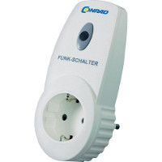
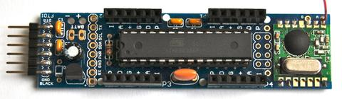
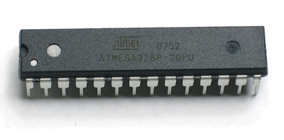

class: center, middle

# Type-safe modern embedded development with C++

A journey into year-long uptimes


Jan Ypma

jan@ypmania.nl

---

# Agenda

- The start of our journey
- Arduino's strengths and weaknesses
- Modern software development
- Embedded techniques
    - Unit testability
    - Continuous integration
    - Interrupt handlers
    - Time constants

---

# A little bit about me

- By day
 - Software architect at [Tradeshift](https://tradeshift.com/about/), a platform for business interactions
 - Deal with 100K+ LoC code bases on a daily basis
 - CI/CD, Unit testing, Integration testing, Docker

- By night
 - Electrical engineering
 - Home automation
 
---

# A journey starts

- Let's automate dimming the lights when watching a movie

.center[]

---

# A journey starts

- **Kodi**
  - Media center software with JSON API

.floatright[]
- **FS20** 
  - Affordable home automation devices
  - [Well-documented protocol](http://fhz4linux.info/tiki-index.php?page=FS20+Protocol) on the 868MHz band
  - Simple on-off keying

.floatright[]
- **JeeNode** 
  - ATMega328 microcontroller
  - RFM12B 868MHz radio
  - Arduino software support 
  - Existing library to transmit FS20 signals

---

# Miniaturization

(picture of tiny328 here)

---

# Introducing our hero

.center[]

- Atmel (now Microchip) **atmega328p**
  - 32 KB Flash program ROM
  - 2KB RAM
  - 1KB Flash EEPROM
- Why use something this limited? Power!
  - 10 μA in sleep (~30 μW)
  - 8 mA when awake (~30 mW)
  - Comparison: Raspberry Pi 2000mW, Intel Atom 16000mW
---

# Arduino: blinking an LED

- Seems simple enough

```
void setup() {
  pinMode(LED_BUILTIN, OUTPUT);
}

void loop() {
  digitalWrite(LED_BUILTIN, HIGH);
  delay(1000);
  digitalWrite(LED_BUILTIN, LOW);
  delay(1000);
}
```

--

- However
  - What is `LED_BUILTIN`?
  - `digitalWrite(HIGH, LED_BUILTIN);`
  - Where is `main()`?

---

# Arduino: blinking an LED

- Let's look it up
- In `pins_arduino.h`: 

```
#define LED_BUILTIN 13
```

- In `Arduino.h`: 

```
#define HIGH 0x1
#define LOW  0x0

#define INPUT 0x0
#define OUTPUT 0x1
```

- So, we're actually saying `digitalWrite(13, 1);`
- Wait, they said this was C++?

---

# Arduino: blinking an LED

- Let's hunt down `main()`  
- Ah, in `cores/arduino/main.cpp`:

```
int main(void)
{
* init();
  // [...]
  setup();
    
  for (;;) {
    loop();
    // [...]
  }
  return 0;
}

```

---

# Arduino: blinking an LED

- And, `wiring.c`:

```
void init()
{
#if defined(TCCR0A) && defined(WGM01)
	sbi(TCCR0A, WGM01);
	sbi(TCCR0A, WGM00);
#endif

#if defined(__AVR_ATmega128__)
	sbi(TCCR0, CS02);
#elif defined(TCCR0) && defined(CS01) && defined(CS00)
	sbi(TCCR0, CS01);
	sbi(TCCR0, CS00);
#elif defined(TCCR0B) && defined(CS01) && defined(CS00)
	sbi(TCCR0B, CS01);
	sbi(TCCR0B, CS00);
#elif defined(TCCR0A) && defined(CS01) && defined(CS00)
	sbi(TCCR0A, CS01);
	sbi(TCCR0A, CS00);
#else
	#error Timer 0 prescale factor 64 not set correctly
#endif

  // 150 more lines of #define and direct register mangling
}
```

---

# The arduino ecosystem

- Works well
  - Libraries available for any hardware you can imagine
  - They generally do work
  - Very broad community with good hardware tips
  - Useable defaults for AVR initialization
- Works not so well
  - AVR initialization isn't customizable
  - Libraries not necessarily work _together_ (no HAL, no way to declare interrupt handlers)
  - Libraries have no unit tests
  - The core has no unit tests
- Code basically gets written, tested on hardware, and then "don't touch it"
- RFM12 Arduino library is a good example of the above
- Oh, and no `Makefile` or build system of any kind

We must be able to do better than this!


---

# Introducing AvrLib

- An attempt to increase maintainability of C++ AVR code
- Let's blink an LED, again

```
#include "HAL/Atmel/Device.hpp"
#include "Time/RealTimer.hpp"

using namespace HAL::Atmel;
using namespace Time;

auto LED = ArduinoPinD9();
auto timer0 = Timer0::withPrescaler<1024>::inNormalMode();
auto rt = realTimer(timer0);

int main() {
  LED.configureAsOutputLow();
  while (true) {
    LED.setHigh();
    rt.delay(1_s);
    LED.setLow();
    rt.delay(1_s);
  }
}
```

---

# Type-safe pins

```
*auto LED = ArduinoPinD9();
auto timer0 = Timer0::withPrescaler<1024>::inNormalMode();
auto rt = realTimer(timer0);

int main() {
  LED.configureAsOutputLow();
  while (true) {
    LED.setHigh();
    rt.delay(1_s);
    LED.setLow();
    rt.delay(1_s);
  }
}
```

- Pins are type-safe
  - Different AVR pins have different features, and each pin has its own class
  - Doing `myPin.comparator().setTarget(15)` on a non-PWM pin is a compile error

---

# Type-safe time handling

```
auto LED = ArduinoPinD9();
auto timer0 = Timer0::withPrescaler<1024>::inNormalMode();
*auto rt = realTimer(timer0);

int main() {
  LED.configureAsOutputLow();
  while (true) {
    LED.setHigh();
*   rt.delay(1_s);
    LED.setLow();
    rt.delay(1_s);
  }
}
```

- Time is type-safe
  - Converting timer units to real time units is externalized to `RealTimer`
     - And, hence, can be [unit tested](https://github.com/jypma/AvrLib/blob/master/tst/RealTimerTest.cpp)
  - `RealTimer` works on any timer, and any prescaler
  - Conversion factors are compile-time known, so `delay(1_s)` compiles down to a  constant
  - Compiler error if using too small or too large time constants

_Note_: Prefer using `periodic` or `deadline` instead of `delay`.

---

# Encapsulation and testability

- Having all your code in `main.cpp` makes it kinda hard to unit test
- Write a class instead for your app

```
#define auto_var(name, expr) decltype(expr) name = expr  // pre-C++ 17

template<typename led_t, typename timer_t>
class Blink {
  led_t * const LED;
  timer_t * const timer;
  
  auto_var(rt, realTimer(*timer));
public:
  Blink(led_t &l, timer_t &t): LED(&l), timer(&t) {
    LED->configureAsOutputLow();
  }
  
  void loop() {
    LED->setHigh();
    rt.delay(1_s);
    LED->setLow();
    rt.delay(1_s);
  }
};
```

---

# Interrupts

- Original problem: interrupt handlers are global-scope `"C"` style functions in `avr-gcc`
- Solution: framework takes ownership of these handlers, delegating to user class member functions
  - A bit of macro, a lot of `type_traits`
  
```
class MyApp {
  auto_var(button, ArduinoPinD8());  
  void onButton() { /* handle button press */ }

public:
  typedef On<MyApp, typename button::INT, &MyApp:onButton> Handlers;
  void loop() { /* main application loop */ }
};

RUN_APP(MyApp)  // declares main() and interrupt handlers
```

- Handlers are known at compile time, so optimizer can fully inline them
- Handlers can be composed, e.g.
  ```
    typedef On<MyApp, typename button::INT, &MyApp:onButton,
            Delegate<MyApp, decltype(blink), &MyApp::blink>> handlers;
  ```
---

# Testing at any level

- Let's take a closer look at `RealTimer`
  - Unit testable, since there are no direct dependencies on avr-libc
  - [Tests](https://github.com/jypma/AvrLib/blob/master/tst/RealTimerTest.cpp#L34) using Google Test
  - [Implementation](https://github.com/jypma/AvrLib/blob/master/inc/Time/RealTimer.hpp#L41)

---

# Continuous integration

- GCC (and avr-gcc) is a particularly troubled piece of software
  - Most major upgrades I've tried hit ICE's
  - Currently, avr-gcc 5.4.0, 7.2.0 and 8.1.1 seem to build correctly
- Solution: [docker container with working version](https://github.com/jypma/avr-gcc)
- Build `AvrLib` on Travis CI using [`Makefile`](https://github.com/jypma/AvrLib): 

---

# Status

.floatright[]

- Powering about 100 devices: lights, doors, heating, doorbell
- Tests pay off: if devices fail, it's usually hardware
- Streams library with Protobuf support
- Drivers for RFM12B radio, ESP8266 in AT mode, RS-232, IR decoding, temperature sensors, and more


- Future work
  - Ditch `avr-libc` entirely
  - Move to [ARM and/or Rust](https://japaric.github.io/discovery/)?


Source: [https://github.com/jypma/AvrLib/](https://github.com/jypma/AvrLib/)

Demos: [https://github.com/jypma/AvrLibDemo/tree/master/apps](https://github.com/jypma/AvrLibDemo/tree/master/apps)

---

class: center, middle

# Extra slides

---

# Blinking while doing other stuff

```
template<typename led_t, typename timer_t>
class Blink {
  led_t * const LED;
  timer_t * const timer;
  bool on = false;
  
  auto_var(rt, realTimer(*timer));
  auto_var(toggle, periodic(rt, 500_ms));
public:
  Blink(led_t &l, timer_t &t): LED(&l), timer(&t) {
    LED->configureAsOutputLow();
  }
  
  void loop() {
    if (toggle.isNow()) {
      on = !on;
      LED->setHigh(on);
    }
  }
};
```

---

# Let's build a Button class

```
enum class ButtonEvent: uint8_t { DOWN, UP, PRESSED, RELEASED };

template <typename pin_t>
class Button {
  pin_t * const pin;
  
public:
  Button(pin_t &p): pin(&p) {}
  
  ButtonEvent nextEvent() { /* ... */ }
}
```

- Main loop polls nextEvent() to see what happened

---

# Let's build a Button class

```
enum class ButtonEvent: uint8_t { DOWN, UP, PRESSED, RELEASED };

template <typename pin_t>
class Button {
  typedef Button<pin_t> This;
  pin_t * const pin;
  bool prevState;                     // state before last call to nextEvent()
  volatile bool gotINT = false;       // have we seen an interrupt since nextEvent() ?
  
  void onINT() {
    gotINT = true;
  }
  
public:
  typedef On<This, typename pin_t::INT, &This::onINT> Handlers;

  Button(pin_t &p): pin(&p) {
    pin->configureAsInputWithPullup();
    pin->interruptOnChange();
    prevState = pin->isHigh();
  }
  
  ButtonEvent nextEvent() { /* ... */ }
}
```

- Update our state when an interrupt fires

---

# Let's build a Button class

```
enum class ButtonEvent: uint8_t { DOWN, UP, PRESSED, RELEASED };

template <typename pin_t>
class Button {
  typedef Button<pin_t> This;
  pin_t * const pin;
  bool prevState;                     // state before last call to nextEvent()
  volatile bool gotINT = false;       // have we seen an interrupt since nextEvent() ?
  // [...]
public:
  ButtonEvent nextEvent() {
    const bool state = pin->isHigh();
    if (state == prevState) {
      return (state) ? ButtonEvent::UP : ButtonEvent.DOWN;
    } else {
      return (state) ? ButtonEvent::RELEASED : ButtonEvent::PRESSED;
    }
  }
}
```
- Compare with previous state and emit event, simple enough. But:
  - Shouldn't we use `gotINT` somehow?
  - What if the user manages to press -> release the button between two `nextEvent()` calls?
  - We need to handle [button debounce](https://www.allaboutcircuits.com/technical-articles/switch-bounce-how-to-deal-with-it/)

---

# Let's build a Button class

- Turns out, handling a simple [Button](https://github.com/jypma/AvrLib/blob/master/inc/Mechanic/Button.hpp) isn't so simple in the real world (~100 lines).
- Luckily, we have [unit tests](https://github.com/jypma/AvrLib/blob/master/tst/ButtonTest.cpp) to prove that our button works (~70 lines).
- All code is reusable since it isn't AVR-specific.
