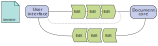
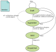

class: center, middle

# Document-core

A new approach to handling documents

Jan Ypma

jyp@tradeshift.com

---

# Agenda

- Rethinking Tradeshift's document strategy
- Internal architecture overview
- Extension points and plugins
- Document lifecycle
- API Overview

---

# Rethinking Tradeshift's document strategy

- Classic document management is 1 single component (`Backend-Service`)
  - with 1 single database
  - 1 struggling queue, 1 replacement with higher hopes
  - numerous developers across teams, fighting for attention

- Tradeshift is growing
  - &gt; 1.000.000 companies
  - &gt; 1.000 developers (any day now...)
  - Demand for bigger documents and attachments (100MB+)

- However, the classic pipeline is very much still alive
  - Many thanks to SRE and Backend-Service teams

---

# Rethinking Tradeshift's document strategy

- Still, document management needed a redesign
  - Scale to more companies and documents
  - Scale to bigger document sizes
  - Scale to concurrent development teams
  - Cross-tenant collaboration

- Architectural guidelines
  - No single points of failure
  - Sharding on all levels
  - Don't keep entire document in memory (stream instead)
  - Extension points and plugins

---

# Document-core architecture overview

.center[]

- Sharded **document-core** cluster handles incoming requests to documents
- **Cassandra** cluster stores journal of document events
- **S3** stores large binary content (initial uploads, attachments)

- All presented features and APIs are [live in
  production](https://api.tradeshift.com/tradeshift/rest/external/documents/v2/_docs/), and available to
  _anyone_ on Tradeshift to use.

---

# Document-core anatomy

- **Document** has XML content
  - Based on a **document type** that describes what XML structures are valid

- **Access control list** (ACL) defines which users and user groups can do what
  - Users with access need not be in the same tenant (or even zone)

- Document can be replicated to other **zones** (separate ACL in each zone)

- A document is linked to one or more **identity** which can be the sender, receiver, or other roles for that
  document. These are typically _tenants_ on `Backend-Service`.

- Document content consists of an **initial upload**, and subsequent **edits** that are made by users
  - Embedded attachments are automatically split off internally
  - No practical limit on initial upload or attachment size

---

# Editing of documents

- Many users should be able to observe the same document, as it is being edited

.center[]

- Exchange small edits ("deltas")
  - Read: document event stream
  - Write: edit API

- Specialized API to add attachments

- More in-depth explanation and demo in later talk

---

# Extension points and plugins

- Many things in document-core are pluggable and can be influenced by external systems
  - **Document type** can be externally defined
  - Systems can **listen** to the event stream on accounts that trust them
  - Document **validation** and **augmentation** is done by external systems

- All of this can be done by anyone on Tradeshift (typically a routable business identifier is required)
  1. Explorative testing on sandbox
  2. Write mocks
  3. Implement your plugin against mocks
  4. Test plugin on sandbox

- Contact `slack://#paas-docpipe` to get help with writing a plugin or designing your mocks.

---

# Extension points and plugins

- Pluggable document types
  - A **document type** is "just" an XSD, where the XSD's `targetNamespace` is the document type (and the XSD only
    defines 1 tag in that namespace).
  - Must use UBL 2.2 [Unqualified data
    types](http://www.datypic.com/sc/ubl21/s-UBL-UnqualifiedDataTypes-2.1.xsd.html) as leaf types (Amount,
    Date, Measurement, etc.)
  - Can make use of UBL 2.2 [Common basic
    components](http://www.datypic.com/sc/ubl21/s-UBL-CommonBasicComponents-2.1.xsd.html) and [Common
    aggregate components](http://www.datypic.com/sc/ubl21/s-UBL-CommonAggregateComponents-2.1.xsd.html).
  - All 72 standard UBL 2.2 document types are available already

- Creating a new document type
  - Anyone with a business identifier on TS can create a document type via API
    * For example, `123456768.cvr.dk` can register
      `urn:tradeshift:document-core:type:truebn:v1:12345678.cvr.dk:mytype`, with the XSD defining a `<MyType>`
      tag in that namespace.
  - All document types are globally available to everyone on all zones

---

# Extension points and plugins

- Listener plugin
  - Observes the **event stream** for identities where it is installed
  - Identities must _install_ the listener plugin first
  - After that, any document created for that identity, or addressed to it, it visible to the listener plugin.

- Creating a listener plugin
  - Anyone with a business identifier on TS can register a listener plugin via API
  - All listener plugins are available to everyone in the same zone

---

# Extension points and plugins

- Validation plugin
  - Reports **validation errors** after any edit for a document, by observing the **event stream** and making
    **callbacks**.
  - Decides on its own SLA for how fast it will call back
  - Callback contains either validation errors, or "this doc is fine"

- Creating a validation plugin
  - Anyone with a business identifier on TS can register a validation plugin via API
  - Validators can either be installed by anyone in the same zone, or "private".

---

# Extension points and plugins

- Augmentation plugin
  - Reports **augmentations** and/or **validation errors** after any edit for a document, by observing the
    **event stream** and making **callbacks**.
  - Decides on its own SLA for how fast it will call back
  - Augmentation is an additional edit that is to be applied to the document, e.g.:
        - Auto-complete receiver information
        - Calculate totals
        - Auto-apply discounts
  - Augmentors can report validation errors, just like a validation plugin

- Creating an augmentor plugin
  - Anyone with a business identifier on TS can register an augmentor plugin via API
  - Augmentors can either be installed by anyone in the same zone, or "private".

---

# Document lifecycle

.floatright[]

- **Draft**:
  - Document has just received an edit.
- **Augmented**
  - All augmentors have called back, and there were no errors.
- **Valid**
  - All validators have called back, and there were no errors.
- **Dispatched**
  - The document has been marked as sent / dispatched.

---

class: center, middle

# Reality ends here.

The upcoming features are still in various stages of development.

---

# Document listing and indexing

- New service **document-indexer**
  - Reads from the document journal on `Backend-Service`
  - Reads from the event stream on `document-core`

- Unified elasticsearch index
  - Based on document content and dispatch state

- User-defined **index definitions** (just like document types)
  - Reindexing happens automatically and on-demand
  - Define **links** between documents (Application Response -> Invoice, Invoice -> Order)

- ETA (an initial version): 2 months

---

# Security plugins

- Dispatching does not grant any users/groups in the receiver access yet
  - Current semantics for that in `Backend-Service` have shown not to be a one-size-fits-all

- New plugin type: **security plugin**
  - Can **listen** to events, and make changes to documents' ACL
  - For example, give certain users or groups access on certain documents, or arbitrary rules

- ETA: 2 months

---

# Multi-zone editing

- `document-core` is being deployed in our China zone

- Separate cluster first, but we will be linking them up to make use of our replication features

- ETA: 4 months

---

# Share your thoughts

- Slack: `#paas-docpipe`

- API reference documentation:
  - [https://api.tradeshift.com/tradeshift/rest/external/documents/v2/](https://api.tradeshift.com/tradeshift/rest/external/documents/v2/)

- API user's guide:
  - [https://github.com/Tradeshift/document-core/#documentation](https://github.com/Tradeshift/document-core/#documentation)
