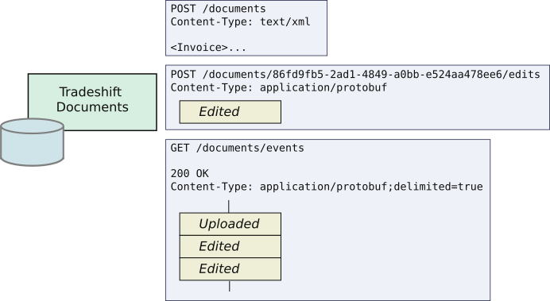
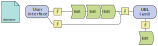
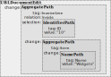
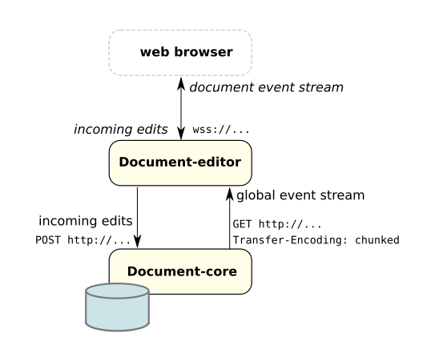
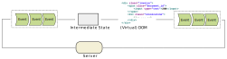
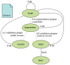
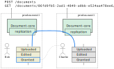

class: center, middle

# Reactive user interfaces

Building a reactive multi-user document editor in ScalaJS

Jan Ypma

`jyp@tradeshift.com`

Slides: [http://jypma.github.io](http://jypma.github.io)

---

# Agenda

- Rationale for rethinking Tradeshift's documents and editing
- Something about languages and type safety
- Reactive editing architecture
- Demo

---

# Setting the scene

- _Tradeshift: A platform for business interactions_


- UBL (Universal Business Language)
  - A set of 65 (huge)
  [XSDs](https://cranesoftwrights.github.io/resources/Crane-UBL-2.1-Skeleton/)
  for describing business interactions in XML
  - An [example invoice](invoice-with-features.xml)
- Current systems throughput of ~10 documents per second

---

# Documents in Tradeshift, 2017

- Monolith backend knows about at least 6 different document formats
  - UBL, "jacksonified" JSON UBL, "official" JSON UBL, Portable (xml),
  Portable (JSON), Canonical
  - These are not convertable into each other without loss
- Sending a document requires it to go through several message queues
  - We have trouble growing HornetQ to our size
- Document "validations" are hardcoded, and scattered around many different places
- Document types are hardcoded
  - Introducing a new document type requires changes in 15+ places
  - As a result, existing document types have _very_ varying behaviours
- Documents are isolated to one account
  - Sending only happens once, and as an actual copy

---

# Documents in Tradeshift, 2020

- Pipeline can send 100s of documents per second, and can scale to 1000s
- Format conversions are well-defined and isolated
- New document types and validations can be introduced by anyone _on the Tradeshift network_
- People can collaborate on documents in real-time, across legal regions

---

# Event journal

.center[]

- Real-time collaboration requires delta updates
- No "replace content" API
  - Instead, all edits must be saved as incremental changes
  - Edits appear on the event stream

---

# Writing a document editor

- Traditionally
.center[]

  - Read the whole UBL XML document
  - Transform it into a JSON variant
  - Transform it into an in-memory structure
  - Transform it into user interface elements
- User changed anything on the screen?
  - Do the above in reverse
- Another user changed anything?
  - Repeat the whole flow again

---

# Writing a reactive document editor

- Define things that constitute changes to a document
  - let's call them *Edits*

.center[]
- Transform a *stream* of edit **events** directly into user interface elements
  - (Redux: *action*, Elm: *message*)
- User changed anything on the screen?
  - Emit an change, and see it arrive on the incoming event stream
- Another user changed anything?
  - Automatically handled as long as it hits the event stream

---

# Editing UBL, one field at a time
.floatleft[]

- Start at the document root
- Amongst the [Aggregate tag (cac:)](http://www.datypic.com/sc/ubl21/ns-cac.html)
  [InvoiceLine](http://www.datypic.com/sc/ubl21/e-cac_InvoiceLine.html), locate the one that has _inside_ a
  [udt:IdentifierType tag](http://www.datypic.com/sc/ubl21/t-udt_IdentifierType.html)
  [ID](http://www.datypic.com/sc/ubl21/t-cbc_IDType.html), with value `"10"`, or create such an `InvoiceLine`
  if it doesn't exist yet.
- Inside here, find the [Aggregate tag (cac:)](http://www.datypic.com/sc/ubl21/ns-cac.html)
  [Item](http://www.datypic.com/sc/ubl21/e-cac_Item.html), or create it if it doesn't exist. _(The XSD
  prescribes that only one `Item` exists here, so no "selection" applies)_.
- Inside here, find the [udt:NameType](http://www.datypic.com/sc/ubl21/t-udt_NameType.html) tag
  [Name](http://www.datypic.com/sc/ubl21/t-cbc_NameType.html) or create it, and replace its value with
  `"Widgets"`.

---

# Editing UBL, one field at a time
.floatleft[]

```xml
<!-- Before applying edit: -->
<Invoice xmlns="..." xmlns:cac="..." xmlns:cbc="...">
</Invoice>
```

_turns into_

```xml
<!-- After applying edit: -->
<Invoice xmlns="..." xmlns:cac="..." xmlns:cbc="...">
  <cac:InvoiceLine>
    <cbc:ID>10</cbc:ID>
    <cac:Item>
      <cbc:Name>Widgets</cbc:Name>
    </cac:Item>
  </cac:InvoiceLine>
</Invoice>
```

---

# Editing UBL, one field at a time
.floatleft[]

```xml
<!-- Before applying edit: -->
<Invoice xmlns="..." xmlns:cac="..." xmlns:cbc="...">
  <cac:InvoiceLine>
    <cbc:ID>10</cbc:ID>
    <cac:Note>This is my precious line.</cac:Note>
  </cac:InvoiceLine>
</Invoice>
```

_Existing information remains unchanged:_

```xml
<!-- After applying edit: -->
<Invoice xmlns="..." xmlns:cac="..." xmlns:cbc="...">
  <cac:InvoiceLine>
    <cbc:ID>10</cbc:ID>
    <cac:Note>This is my precious line.</cac:Note>
    <cac:Item>
      <cbc:Name>Widgets</cbc:Name>
    </cac:Item>
  </cac:InvoiceLine>
</Invoice>
```

---

# Editing UBL, one field at a time
.floatleft[]

```xml
<!-- Before applying edit: -->
<Invoice xmlns="..." xmlns:cac="..." xmlns:cbc="...">
  <cac:InvoiceLine>
    <cbc:ID>10</cbc:ID>
    <cac:Item>
      <cbc:Name>Stuff</cbc:Name>
    </cac:Item>
  </cac:InvoiceLine>
</Invoice>
```

_Replace `InvoiceLine/Item/Name`, keep the rest:_

```xml
<!-- After applying edit: -->
<Invoice xmlns="..." xmlns:cac="..." xmlns:cbc="...">
  <cac:InvoiceLine>
    <cbc:ID>10</cbc:ID>
    <cac:Item>
      <cbc:Name>Widgets</cbc:Name>
    </cac:Item>
  </cac:InvoiceLine>
</Invoice>
```
---

# A ScalaJS example script

Or is this JavaScript?
```scala
var xhr = new XMLHttpRequest()
xhr.open("GET",
  "https://api.twitter.com/1.1/search/" +
  "tweets.json?q=%23javascript"
)
xhr.onload = (e: Event) => {
  if (xhr.status == 200) {
    var r = JSON.parse(xhr.responseTest)
    $("#tweets").html(parseTweets(r))
  }
}
xhr.send()

```

.smallright[_ * 2016, Otto Chrons, Scala.js for large and complex frontend apps_]

---

# A ScalaJS example script

Or is this JavaScript? Look again!
```scala
var xhr = new XMLHttpRequest()
xhr.open("GET",
  "https://api.twitter.com/1.1/search/" +
  "tweets.json?q=%23javascript"
)
*xhr.onload = (e: Event) => {
  if (xhr.status == 200) {
    var r = JSON.parse(xhr.responseTest)
    $("#tweets").html(parseTweets(r))
  }
}
xhr.send()

```
This is fully type-safe Scala code.

---

# What is ScalaJS?

- Write Scala, compile to JavaScript, run in browser or NodeJS
- Supports 100% of Scala language
- Straightforward interop with JavaScript (even dynamic typing)
- Performs as well as hand-written JavaScript
- Generated JS code is small enough for desktop usage (perhaps mobile)
  - Our PoC: 1.6MB (that's including ProtoBuf generated classes, full CLDR, streams library, everything).
- Fast edit-compile-run cycle
- Only a language, not an architecture

---

# Why a better JavaScript?
- Types: testability, refactoring, discoverability
- More modular and expressive code
- One language across client and server
- Tool-friendly and better IDE support
- You always have types, even though you may not see them
  - [Perl and Python creators agree](https://thenewstack.io/a-conversation-with-the-creators-behind-python-java-typescript-and-perl/) *

.smallright[ \* https://thenewstack.io/a-conversation-with-the-creators-behind-python-java-typescript-and-perl/]

---

# Editor architecture

.center[]

- Backend core system `document-core` has journal of initial uploads, edits, and metadata
- `document-editor` does server side rendering and event security isolation

---

class: center, middle

# Demo

---

# In-browser state management

.center[]

- Our **Event** is a
  [`UBLDocumentEdit`](https://api.tradeshift.com/tradeshift/rest/external/documents/v2/_docs/UBLDocumentEdit.html#com.tradeshift.documentcore.data.UBLDocumentEdit),
  a single edit to a document
- Define intermediate [DTO
  classes](https://github.com/Tradeshift/document-editor/blob/master/data/src/main/scala/com/tradeshift/documents/state/Invoice.scala#L18)
  that holds our on-screen state
  - Immutable to make testing easier
  - Returns updated instance as result of event
  - [Unit-testable](https://github.com/Tradeshift/document-editor/blob/master/data/src/test/scala/com/tradeshift/documents/state/InvoiceSpec.scala#L30) outside of reactive framework
- State classes map to (virtual) DOM, [`example render() function`](https://github.com/Tradeshift/document-editor/blob/master/frontend/src/main/scala/com/tradeshift/documents/invoice/LineComponent.scala#L128)

---

# A few words about performance

- 500 events render in 10ms
- Cassandra ordering journal on disk
- Protobuf deserialization
- Snapshots
- Event stream latency

---

# Choosing ScalaJS for this application

- Not the first choice
  - _React + Redux + Typescript_: not an obvious fit, not full type safety
  - _React + Redux (plain JS)_: Too verbose code (e.g. event matching)
  - _Elm_: Smaller community, maturity, client-side only
- But a very nice fit
  - Very mature language and type system
  - Built-in immutability, futures, pattern matching
  - Surprisingly big community

---

# Conclusion

- Real-time collaboration: working
- Reactive style increases testability and state management
- Language: type safety and pattern matching
- Code reuse between server and browser

Try this yourself

- Tradeshift API documentation:
  - [http://developer.tradeshift.com](http://developer.tradeshift.com)
  - [https://api.tradeshift.com/tradeshift/rest/external/documents/v2/_docs/http.html](https://api.tradeshift.com/tradeshift/rest/external/documents/v2/_docs/http.html)
- Outwatch: [http://outwatch.github.io/](http://outwatch.github.io/)
- Akka persistence: [https://doc.akka.io/docs/akka/2.5/persistence.html](https://doc.akka.io/docs/akka/2.5/persistence.html)
- Tradeshift Reaktive: [https://github.com/Tradeshift/ts-reaktive](https://github.com/Tradeshift/ts-reaktive)

**We're hiring!**

Find Tradeshift online, or `jyp@tradeshift.com`

---

# Extra slides

---

# Document-core architecture

.center[]

- **document-core** : storage, access control, legal state, regionality
  - Plugins listen to its event journals and call back
- **document type plugins** : manage XSD for a particular type of document
- **validator plugins** : contribute to decide whether the legal state is OK to change to "sent"
- **augmentor plugins** : contribute additional edits whenever the document is changed (e.g. totals)

---

# Document-core pipeline

.floatright[]

- Documents are not copied
  - Sender and receiver use the same UUID
- Instead, document legal state is maintained
  - **Draft**: people with write access can edit the document. Validation plugins contribute to whether the document is valid for sending or not
  - **Sent**: document was valid, and now has legal status. In addition, receiver gets
  access (in default scenario)
- No way to undo sending
- No hard deletions (except for "wipe account" scenarios)

---

# Pluggable document types

- What's the big deal?
  - Tradeshift Platform doesn't want to OK every new doc type
  - Allow teams, integrators, users to experiment
- But we do want _some_ say on what's stored as a document
  - Pipeline implies knowing a _sender_ and _receiver_
  - Real-time editing needs common primitive building blocks
- UBL to the rescue: pluggable document types can use components from the following UBL namespaces, and group them into new aggregates
  - `CommonAggregateComponents-2`
  - `CommonBasicComponents-2`
  - `CommonExtensionComponents-2`
  - `QualifiedDataTypes-2`
  - `UnqualifiedDataTypes-2`
  - (and a few others)
- Document type plugin uploads an XSD to `document-core`
- XSDs are identified by their namespace
  - `xsd:annotation` indicating what's the sender and receiver

---

# Multiple regions

.center[]

- Each document maintains a set of regions it is visible to
  - Granting an off-region user access to the document adds to this list
- Only on the "home" region can a document be written to (edited)
- All other regions receive read-only copies of events

---

```
curl -v -X POST \
         -H 'X-Tradeshift-ActorId: 784cfacd-8e63-4a08-b823-2c094aaf0f0c' \
         -H 'X-Tradeshift-TenantId: a0b6e3f6-54e9-4bc1-bd82-f088466acee4' \
         -H 'Content-Type:application/x-vnd.tradeshift.TSUBL' \
         -d @document-core-server/src/test/resources/smallubl.xml \
         http://localhost:8865/documents
         
curl -v \
         -H 'X-Tradeshift-ActorId: 784cfacd-8e63-4a08-b823-2c094aaf0f0c' \
         -H 'X-Tradeshift-TenantId: a0b6e3f6-54e9-4bc1-bd82-f088466acee4' \
         http://localhost:8865/documents/3eaa4f97-1080-4db0-862d-7c810ebf8031 \
         | xmllint --format -

http://localhost:8080/documents/3eaa4f97-1080-4db0-862d-7c810ebf8031

172.17.0.83
```
