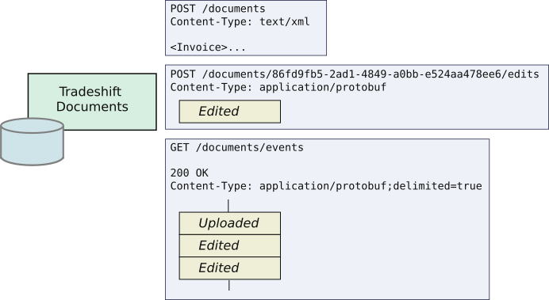
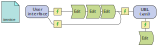
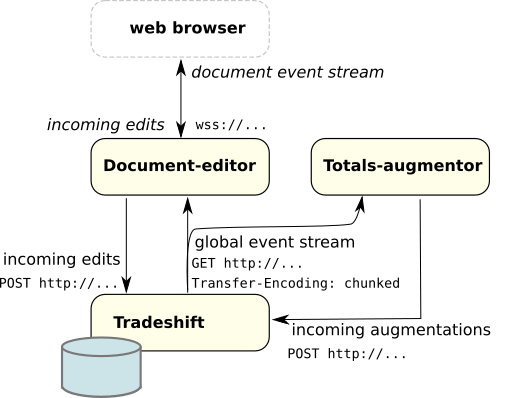

class: center, middle

# Generic document formats on Tradeshift

Allowing anyone to create new business flows

Jan Ypma

`jyp@tradeshift.com`

Slides: [http://jypma.github.io](http://jypma.github.io)

---

# A fresh look at documents

- Challenges when introducing new business flows
  - Centralized knowledge of fixed set of document types
  - Code changes required for new document types

- Growth needed in two dimensions
  1. Ease **introduction** of new document types
  2. Make document flows more **scalable**, and more **collaborative**

---

# Document pipeline principles

- Pipeline can process 100s of documents per second, and can scale to 1000s
- Format conversions are well-defined and isolated
- New document types and validations can be introduced by anyone _on the Tradeshift network_
- People can collaborate on documents in real-time, across legal regions

---

# Building your own document type

1. Create an XSD
  - Can refer to any [UBL 2.2](http://www.datypic.com/sc/ubl22/ss.html) common components
  - XML namespace must include your registered Tradeshift business identifier

2. Upload it to `POST /documents/v2/documentTypes`

- All document types are available to everyone

---

# Document event journal

.center[]

- Real-time collaboration requires delta updates
- No "replace content" API
  - Instead, all edits must be saved as incremental changes
  - Edits appear on the event stream

---

# Writing a reactive document editor

- Define things that constitute changes to a document
  - let's call them *Edits*

.center[]
- Transform a *stream* of edit **events** directly into user interface elements
  - (Redux: *action*, Elm: *message*)
- User changed anything on the screen?
  - Emit a change, and see it arrive on the incoming event stream
- Another user changed anything?
  - Automatically handled as long as it hits the event stream

---

# Editor architecture

.center[]

- Tradeshift Documents backend system has a journal of initial uploads, edits, and metadata
- `document-editor` does server side rendering and event security isolation
- `totals-augmentor` submits augmentations updating the invoice totals after edits

---

class: center, middle

# Demo

---

# Next steps

- Currently in production
  - Full support for all 81 document types in UBL 2.2
  - `<AttachedDocument>` integrated in collaboration panel

- Being developed
  - `<RequestForQuotation>` (from requisition/basket)
  - Migrate `<Requisition>` (purchase request)
  - Questionnaires
  - Migrate `<ApplicationResponse>`

- API docs:  [https://api.tradeshift.com/tradeshift/rest/external/documents/v2/_docs/http.html](https://api.tradeshift.com/tradeshift/rest/external/documents/v2/_docs/http.html)

- Questions? `jyp@tradeshift.com`

.smallright[Slides: [http://jypma.github.io](http://jypma.github.io)]
