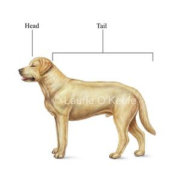

class: center, middle

# Functional fun

.center[]

Jan Ypma

`jyp@tradeshift.com`

Slides: [http://jypma.github.io](http://jypma.github.io)

---
# Functional programming

- What is functional programming?

--

John Hughes:

> Functions with *no side effects* operating on *immutable data structures*

Wikipedia:

> [...] *avoids changing state* and mutable data
> [...] expressions or *declarations* instead of statements

---
# Pure functions

- A function has **side effects** if it has an observable effect besides returning a value

- A function with no side effects is a **pure function**

- A pure function will always return the **same result** for the **same arguments**, since history cannot affect it

---
# Pure functions

What can we expect from this function?

```js
function add(a, b) {
  // [...]
}
```

---
# Pure functions

What can we expect from this function?

```js
function add(a, b) {
  return a + b;
}
```

---
# Pure functions

What can we expect from this function?

```js
function add(a, b) {
  return "It was " + a + " and " + b;
}
```

---
# Pure functions

What can we expect from this function?

```js
var found;

function add(a, b) {
  found += a;
  found += b;
  return found;
}
```

---
# Pure functions

What can we expect from this function?

```js
var found;

function add(a, b) {
  found += a;
  found += b;
}
```

---
# Pure functions: other languages

What can we expect from this function?

_Scala_

```scala
def add(a: Int, b: Int): Int = {
  a + b
}
```

--

_Haskell_

```haskell
add :: Int -> Int -> Int
add a b = a + b
```

---
# Pure functions

Advantages:

--

- Testable
- Composable (with enough compiler help)

---
# Higher-order functions

Say we have a list of numbers:
```scala
val nums: Seq[Int] = Seq(1, 2, 3)
```

But we want to put it into a function that wants a list of strings:
```scala
def count(lines: Seq[String]): Int
```

--
We could go old-school:
```scala
val result = collection.mutable.Seq.empty[String]

for (i <- nums) {
  result += i.toString
}

count(result.toSeq)
```

---
# Higher-order functions

We want to apply a function to every element in the list.

Assume the following exists:
```scala
def applyToEach(list: Seq[Int], function: Int => String): Seq[String]
```

We can now write
```scala
val nums: Seq[Int] = Seq(1, 2, 3)

def numberToString(num: Int): String = num.toString

count(applyToEach(nums, numberToString))
```

---
# Higher-order functions

Having to introduce a name for `numberToString` is quite tedious. Most languages don't require this these days.

A **lambda function** is a function with no name, which is typically written as a literal in an argument list
where a function is expected.

These exist in Scala (`=>`), Java (`->`), Haskell (`\`), Clojure (`fn`), ...

Our example now becomes
```scala
count(applyToEach(nums, i => i.toString))
```

or even

```scala
count(applyToEach(nums, _.toString))
```

---
# Higher-order functions

Most languages have the "apply this to everything" operator in their standard library.

It's usually called `map`.

_Scala_
```scala
count(nums.map(_.toString))
```

_JavaScript_ (immutableJS)
```js
count(nums.map(i => i.toString()))
```

_Haskell_
```haskell
count (map show nums)

-- or the equivalent :
count $ map show nums
```

---
# Immutable data structures

- Writing pure functions requires guarantees that their arguments aren't being modified
- Can't use `array`, `java.util.Collection`, `scala.collection.mutable`, ...

An **immutable data structure** is an object that codifies a data structure, but can't be modified after initial creation.

- In order to effectuate change, a copy has to be created.

---
# Immutable data structures

### Naive example

Let's wrap an array, and copy it when we append, so it's nice and immutable:

```scala
class MyList(private items: Array[String]) {
  def add(s: String): MyList = {
    val newItems = new Array[String](items.size + 1)
    Array.copy(items, 0, newItems, 0, items.size)
    newItems(newItems.size - 1) = s
    new MyList(newItems)
  }
}
```

--
...that's pretty expensive!

---
# Immutable data structures

A linked list is a pretty cool, immutable data structure:

```scala
trait LinkedList
object Empty extends LinkedList
case class Item(head: String, tail: LinkedList) extends LinkedList
```

--
- We can always prepend to the list by just creating a new object
- All the existing list is actually re-used

A **persistent data structure** is an immutable data structure that re-uses (part of) existing immutable instances.

---
# Exercise 1: Pure functions and randomness

We have three different functions that each return a welcome message based on a `name` parameter.

Write a **pure** function that, given a `name` argument (and possibly other arguments), randomly invokes one of the three target functions.

---
# Exercise 2: Immutable data structures

Write an **immutable, persistent list-like** data structure that is:
- Order-preserving
- Does not check for duplicates
- Has an efficient operation for appending at the end
- Has an efficient operation for prepending at the beginning
- Has an efficient operation for iterating through the list in order

---
# Why are lambda functions called that way?

It's... complicated. From
[stackexchange](https://math.stackexchange.com/questions/64468/why-is-lambda-calculus-named-after-that-specific-greek-letter-why-not-rho-calc):

> We end this introduction by telling what seems to be the story how the letter 'λ' was chosen to denote
> function abstraction. In _Principia Mathematica_ the notation for the function `f` with `f(x)=2x+1` is
> `2x̂+1`. Church originally intended to use the notation `x̂.2x+1`. The typesetter could not position the hat on
> top of the _x_ and placed it in front of it, resulting in `∧x.2x+1`. Then another typesetter changed it into
> `λx.2x+1`.

---
class: center, middle
# Functional fun

.center[]

Session 2

Jan Ypma

`jyp@tradeshift.com`

Slides: [http://jypma.github.io](http://jypma.github.io)

---
# Exercise 1: Pure functions and randomness

Write a **pure** function that, given a `name` argument (and possibly other arguments), randomly invokes one of three target functions.

--

```scala
def welcome1(name: String): String = ???
def welcome2(name: String): String = ???
def welcome3(name: String): String = ???

def welcome(name: String, ???): String = ???
```

--

What can we use to represent "randomness" ? What is _randomness_, really?

---
# Exercise 1: Pure functions and randomness

Psuedo-random number generator:
- Take a _seed_ (or some other entropy)
- Generate a next random number on request

--

Let's formalize that in an immutable data structure:

```scala
case class RNG(entropy: ByteString) {
  def nextLong(max: Long): (Long, RNG) = ???
}
```

---
# Exercise 1: Pure functions and randomness

Let's use it in our function:

```scala
def welcome(name: String, random: RNG): (String, RNG) = {
  random.nextLong(3) match {
    case (0, r) => (welcome1(name), r)
    case (1, r) => (welcome2(name), r)
    case (2, r) => (welcome3(name), r)
  }
}
```

--

Notes
- Randomness can be represented as an immutable data structure
  - (to some extent)
- Code doesn't look so nice yet
  - Let's revisit it after we deal with the "m" word.

---
# Exercise 2: Immutable data structures

Write an **immutable, persistent list-like** data structure that can performantly _append_ AND _prepend_.

--
- A linked list can efficiently prepend
- What if we postpone all appends until later?
  - Store append operations in a function
- From Haskell: [DiffList](http://h2.jaguarpaw.co.uk/posts/demystifying-dlist/)

---
# Exercise 2: Immutable data structures

.floatleft[

```scala
class DiffList[A](make: List[A] => List[T]) {
  // prepend: O(1)
  def +:(a: A) = new DiffList[A] (
    z => a :: make(z)
  )

  // append: O(1)
  def :+(a: A) = new DiffList[A] (
    z => make(a :: z)
  )

  // appendAll: O(1)
  def ++=(as: DiffList[A]) = new DiffList[A] (
    z => make(as.make(z))
  )

  // O(n)
  def toList = make(Nil)
}

object DiffList {
  def empty[A] = new DiffList(z => z)
}
```
]

--

Rough sketch as to why this works:

```
empty[Int] :
  make = z => z

3 +: empty[Int] :
  make = z => 3 :: (empty[Int].make(z))
       = z => 3 :: z

3 +: empty[Int] :+ 4 :
  make = z => (3 +: empty[Int]).make(4 :: z)
       = z => 3 :: 4 :: z
```

.floatleft[
.small[source: https://blog.tmorris.net/posts/list-with-o1-cons-and-snoc-in-scala/]
]

---
# Exercise 2: Immutable data structures

Notes
- Alternative: [Finger tree](http://andrew.gibiansky.com/blog/haskell/finger-trees/)

---
# Asynchronous programming

- What is _asynchronous programming_?

--

- Why would you want to program like that?
  - Default Java 8 thread stack size is 1M
  - 200 connections is 200MB memory, _just for the stacks_

- But also, threads can be a performance bottleneck *

.smallright[`* on compiled code]

---

# Latency in computer systems

This is how long certain operations take for a CPU (2012, [source](https://people.eecs.berkeley.edu/~rcs/research/interactive_latency.html))

```text
L1 cache reference                           0.5 ns
Branch mispredict                            5   ns
L2 cache reference                           7   ns
Mutex lock/unlock                           25   ns
Main memory reference                      100   ns
Compress 1K bytes with Zippy             3,000   ns
*Context switch                          10,000   ns (if working set in L2)
Send 1K bytes over 1 Gbps network       10,000   ns
*Context switch                        >100,000   ns (bigger working set)
Read 4K randomly from SSD*             150,000   ns
Read 1 MB sequentially from memory     250,000   ns
Round trip within same datacenter      500,000   ns
Read 1 MB sequentially from SSD*     1,000,000   ns
Disk seek                           10,000,000   ns
Read 1 MB sequentially from disk    20,000,000   ns
Send packet CA->Netherlands->CA    150,000,000   ns
```

---
# Threads and mutexes

- **Thread** : logical thread of execution, scheduled by OS scheduler
- All threads share one memory space
- **Mutex** : _mutually exclusive_ flag that prevents threads from accessing shared resources

--

Advantages
- Close to how the hardware actually works
- The only model generally tought in school
- Blocking on I/O natually equivalent to "this, then this"

Disadvantages
- Expensive (~1M stack)
- Slow to create/destroy
- Deadlock


---
# Futures and callbacks

- **Future** is a handle to a calculation which _eventually_ yields a result
  - Scala, Finagle, Q.js, ... : _Future_ / _Promise_
  - Java 8: `CompletionStage<T>` / `CompletableFuture<T>`
- Can be chained, causing further processing (and further futures) after a stage
  completes
- Can be merged, waiting for several futures' results before commencing

```java
CompletionStage<Done> =

http.request(GET("/tweets"))
    .thenApply(response -> response.getBody())
    .thenApply(body -> parseJSON(body))
    .thenCompose(tweets ->
        http.request(PUT("/subscribe?topic=" + tweets.getMostPopular())))
    .thenApply(response -> Done.getInstance())
    .whenComplete((r,x) -> {
        if (x != null) {
            log.error("Well something went wrong", x);
        }
    });
```

---
# Futures and callbacks

Advantages
- Simple to grasp

Disadvantages
- only one value: no obvious way to stream data
- "callback hell" (remember `RNG`?)
- brittle error handling
- not (easily) cancellable
- still needs locking for shared resources (unless using a single thread)

---
# Functional asynchronous programming

Functional programming:
> Functions with *no side effects* operating on *immutable data structures*

- No side effects? `http.request(...)`
--

- We need to postpone side effects: _laziness_

```
                    | eager                        | lazy
--------------------------------------------------------------------
synchronous         | T                            | =>T         (scala)
                    |                              | Supplier[T] (java)
----------------------------------------------------------------
asyncronous         | Future[T]          (scala)   | IO[T, E]    (zio)
                    | CompletionStage[T] (java)    | Task[T]     (scalaz 7, monix)
```
---
# Programming with zio

- [ZIO](https://zio.dev/docs/overview/overview_index) is a modern Scala library for asynchronous and lazy
  computations

- Defines a single type `ZIO[R, E, A]`
  - `A` is the thing being lazilly, eventually computed
  - `E` is the type of any error (e.g. `IOException`, just `String`, or even `Nothing`)
  - `R` is an environment that's needed for the computation

- _takes an `R` and turns it, eventually, either into an `A` or an `E`_

--

- Type aliases
  - `Task[A] = ZIO[Any, Throwable, A]` is a computation with no environment requirements, and may fail with
    any `Throwable`
  - `IO[E,A] = ZIO[Any, E, A]` is a computation with no environment requirements
  - `UIO[A] = ZIO[Any, Nothing, A]` is a computation that's guaranteed to never fail

---
# Programming with zio

- Let's write a bit of hello world

```scala
import scalaz.zio._
import scalaz.zio.console._
import java.io.IOException

val readName: ZIO[Any, IOException, String] = getStrLn
val greet: ZIO[Any, IOException, Unit] = readName.flatMap(name => welcome(name))

object HelloWorld extends App {
  override def run(args: List[String]): IO[DefaultRuntime, Exception, ExitStatus] =
    greet.map(_ => ExitStatus.ExitNow(0))
}
```

---
# Programming with zio

- Some other interesting abstractions
  - delaying execution:
  ```scala
  def sleep(duration: Duration): ZIO[Clock, Nothing, Unit]
  ```
  - using the current date/time:
  ```scala
  def currentDateTime: ZIO[Any, Nothing, OffsetDateTime]
  ```
  - random numbers:
  ```scala
  def nextLong(n: Long): ZIO[Random, Nothing, Long]
  ```

---
# Exercise 3

- Pick an asynchronous, lazy computation library for your language
  - **Scala**: [ZIO](https://zio.dev/docs/overview/overview_index) [Monix](https://monix.io/docs/3x/eval/task.html) [Cats-effect](https://typelevel.org/cats-effect/datatypes/io.html)
  - **Javascript**: [Fluture](https://github.com/fluture-js/Fluture)
  - **Java**: ...didn't find anything. `Supplier<CompletionStage<T>>` perhaps. Or write-it-yourself.

- Google keywords: `<language-name> asynchronous io monad`

- Using your library, write a program that **recursively** searches a directory and all its files, and **counts** the
  number of **characters**, **words**, and **lines** in those files.

---
# Exercise 4

- Using the same library, write a program that recursively searches a directory and all its files for lines
  containing a given string.
  - Your program must be able to read from several files at once

- Optional extra parts
  - Make sure your program doesn't crash when encountering really long files with no line breaks
  - Make sure your program doesn't hang when encountering symbolic link cycles
  - Extend your program to find expressions spanning multiple lines


---
class: center, middle
# Functional fun

.center[]

Session 3

Jan Ypma

`jyp@tradeshift.com`

Slides: [http://jypma.github.io](http://jypma.github.io)

---
# Exercise 3

Let's define a skeleton for our ZIO application.
```scala
object MyApp extends App {
  type Error = String

  case class Counters(chars: Long = 0, words: Long = 0, lines: Long = 0) {
    def +(b: Counters) = Counters(chars + b.chars, words + b.words, lines + b.lines)
  }
  object Counters {
    val zero = Counters()
  }

  def run(args: List[String]) = myAppLogic.fold(_ => 1, _ => 0)

  val myAppLogic =
    for {
      result <- listAndExpand(Set(Paths.get("").toAbsolutePath()))
      counts <- IO.sequence(result.map(count))
      count = counts.foldLeft(Counters.zero)(_ + _)
      _    <- putStrLn(s"Bytes: ${count.chars}")
    } yield ()

  def listAndExpand(needToList: Set[Path]): IO[Error, Set[Path]] = ???

  def count(file: Path): IO[Error, Counters] = ???
}
```

---
# Exercise 3

Write a method to list files, and then iteratively expand listing new directories.
```scala
  def list(location: Path): IO[Error, List[Path]] = {
    IO {
      Files.newDirectoryStream(location).asScala.map(_.toAbsolutePath()).toList
    }.catchAll {
      case x: IOException => IO.fail(x.getMessage())
      case x => IO.fail(s"Unexpected error: $x")
    }
  }

  def listAndExpand(needToList: Set[Path], seen: Set[Path] = Set.empty): IO[Error, Set[Path]] = {
    for {
      content <- IO.sequence(needToList.map(list))
      newlySeen = content.flatten.toSet
      nowSeen = seen ++ needToList ++ newlySeen
      newDirs = newlySeen.filter(_.toFile().isDirectory()) -- seen -- needToList
      result <- if (newDirs.isEmpty)
        IO.succeed(nowSeen)
      else
        listAndExpand(newDirs, nowSeen)
    } yield result
  }
```
---
# Exercise 3

Write a method to count a file. (incomplete)

```scala
  def count(file: Path): IO[Error, Counters] = {
    IO.succeed(Counters(chars = file.toFile().length())) // .length() doesn't throw
  }
```

---
# Contextual chains

- We have a micro-service architecture, _very_ well distributed

```js
function sayHello(userId) {
    var name = getName(userId);
    var country = getCountry(userId);
    return greet("Hello " + name " from " + country);
}
```

- However, for some users we don't have their name and/or country. What to do?

---

# Contextual chains

- So, let's put in some checks

```js
function sayHello(userId) {
    var name = getName(userId);
    if (name !== undefined && name !== null) {
        var country = getCountry(userId);
        if (country !== undefined && country != null) {
            return greet("Hello " + name " from " + country);
        } else {
          return undefined;
        }
    } else {
        return undefined;
    }
}
```

- There are two problems with this code

--

    1. It's verbose, repeating similar checks
    2. It's mixing contextual logic (`!== undefined`) with functional logic

- Solutions?

---
# Potentially-absent values

- Most languages these days have a type for a "potentially absent" value, that's richer to use than just `null`
  - Agda, Haskell, Idris: **`Maybe`**
  - OCaml, Rust, Scala, ML, Kotlin: **`Option`**
  - Java, Swift: **`Optional`**

--
- Let's switch on some type safety (_Java_), so we can read along

```java
Optional<String> sayHello(String userId) {
  Optional<String> name = getName(userId);
  if (name.isDefined()) {
    Optional<String> country = getCountry(userId);
    if (country.isDefined()) {
      return greet("Hello " + name.get() + " from " + country.get());
    } else {
      return Optional.empty();
    }
  } else {
    return Optional.empty();
  }
}
```

- Well that's not much better. Let's try to re-write this.

---
# Potentially-absent values

- Two important methods in `Optional<T>` (simplified):
```java
static <T> Optional<T> of(T value);
<U> Optional<U> flatMap(Function<T, Optional<U>> f);
```

- Let's make use of `flatMap`
```java
    Optional<String> sayHello(String userId) {
        return getName(userId).flatMap(name ->
            getCountry(userId).flatMap(country ->
                greet("Hello " + name + " from " + country);
            )
        )
    }
```

---
# Capturing failure

- That was nice. But it turns out that our "Name" microservice was written in Ruby, and fails a lot. We'd like to capture those failures.
  - But `Optional` only captures absence of values.

--

- *Scala*, *Haskell*, *Rust*, ...: `Either`, which captures either
  - an **error** (conventionally called `Left`), or
  - a **success** (conventionally called `Right`)

---
# Capturing failure

- Let's use this in some Scala code

```scala
    def sayHello(userId: String): Either[ServiceError, String] = {
      getName(userId).flatMap { name =>
        getCountry(userId).flatMap { country =>
          greet("Hello " + name + " from " country)
        }
      }
    }
```

- Hey, that looks remarkably similar to the `Optional` example earlier.

---
# Re-visiting futures

- Say that in fact our service calls can be written asynchronously, e.g. using
  [zio](https://github.com/zio/zio)

```scala
    def sayHello(userId: String): IO[ServiceError, String] = {
      getName(userId).flatMap { name =>
        getCountry(userId).flatMap { country =>
          greet("Hello " + name + " from " country)
        }
      }
    }
```

- Notice a pattern yet?

---
# Monadic syntax

- It turns out, there a lot of "contextual" types `C`, that can all be defined using two operations
  - `unit` : `T => C[T]`
  - `flatMap` (or `bind`): `(C[T], (T => C[U])) => C[U]`
- We call a type `C` that can define these operations a **Monad** (if they uphold a few
  [laws](https://miklos-martin.github.io/learn/fp/2016/03/10/monad-laws-for-regular-developers.html)).

  (There's often also `map`, but this can be derived from `bind` and `flatMap`).

- Dealing with monadic chains is so common, that languages have added special features that for that.

---
# Monadic syntax

- **Haskell**: `do` syntax (for types that are `Monoid`)

```hk
nameDo :: IO ()
nameDo = do putStr "What is your first name? "
         first <- getLine
         putStr "And your last name? "
         last <- getLine
         let full = first ++ " " ++ last
         in putStrLn ("Pleased to meet you, " ++ full ++ "!")
```

---
# Monadic syntax

- **Rust**: `async` / `await` (this is specific to rust's `Future[T]` concept, unfortunately not for any Monoid)

```rust
async fn sayHello(userId: str) -> str {   // actual return type is Future<Output = str>
  let name = getName(userId).await;
  let country = getCountry(userId).await;
  return greet("Hello " + name + " from " + country);
}
```

---
# Monadic syntax

- **Scala**: `for` comprehension (on any type that has `flatMap`, `map` and/or `filter`)

```scala
val input: List[Int] = 3 :: 2 :: 1 :: Nil
def twice(i: Int): List[Int] = i :: i :: Nil
val output: List[Int] = for {
  i <- input
  j <- twice(i)
} yield i * j
```

Let's try to write our `greet` that way.

--
```scala
def sayHello(userId: String): Either[ServiceError, String] = {
  for {
    name <- getName(userId)
    country <- getCountry(userId)
    msg <- greet("Hello " + name + " from " + country)
  } yield msg
}
```

---
# Abstracting from the monad

- How can we make our `sayHello` method independent even of `Either`?

--
- We need an abstraction
  - _a type that can construct instances (`unit`) and has a member operation (`flatMap`)_

- Can't have simple `interface` or `trait` with `Monad<T>` since that only describes members
    - Bye-bye, Java

--
- Haskell: _type classes_

```haskell
sayHello :: Monad m => m String -> m String
```

---
# Abstracting from the monad

- Scala: [_implicit parameters_](https://docs.scala-lang.org/tour/implicit-parameters.html) and [_type
  constructors_](https://typelevel.org/blog/2016/08/21/hkts-moving-forward.html)

--

Let's revisit our `Either` definition
```scala
def sayHello(userId: String): Either[ServiceError, String] = ???
```

Replace `Either` with a type `M` that has one type parameter, and an implicit argument proving `M` is a `Monad`
```scala
def sayHello[M[_]](userId: M[String])(implicit monad: Monad[M]): M[String] = ???

trait Monad[M[_]] {
  def unit[A](value: A): M[A]
  def bind[A,B](m: M[A])(f: A => M[B]): M[B]
}
```

Now we can implement `Monad` for e.g. Scala's own `Option`:
```scala
implicit val OptionMonad = new Monad[Option] {
  def unit[A](value: A) = Some(a)
  def bind[A,B](m: Option[A])(f: A => Option[B]) = m.flatMap(f)
}
```

---
# Exercise 5

- Find a piece of code (or several) from the Tradeshift systems you're working on, which
  - Makes more than one database (or REST) calls

- And rewrite it in a fully functional style.

---
class: center, middle
# Functional fun

.

.center[]

.

Slides: [http://jypma.github.io](http://jypma.github.io)

---
# Futures, callbacks and IO/Task

Advantages
- Simple to grasp

Disadvantages
- only one value: no obvious way to stream data
- "callback hell"
- brittle error handling (depending on library choices)
- not (easily) cancellable
- still needs locking for shared resources (unless using a single thread)

---

# Latency in computer systems

This is how long certain operations take for a CPU (2012, [source](https://people.eecs.berkeley.edu/~rcs/research/interactive_latency.html))

```text
L1 cache reference                           0.5 ns
Branch mispredict                            5   ns
L2 cache reference                           7   ns
Mutex lock/unlock                           25   ns
Main memory reference                      100   ns
Compress 1K bytes with Zippy             3,000   ns
*Context switch                          10,000   ns (if working set in L2)
Send 1K bytes over 1 Gbps network       10,000   ns
*Context switch                        >100,000   ns (bigger working set)
Read 4K randomly from SSD*             150,000   ns
Read 1 MB sequentially from memory     250,000   ns
Round trip within same datacenter      500,000   ns
Read 1 MB sequentially from SSD*     1,000,000   ns
Disk seek                           10,000,000   ns
Read 1 MB sequentially from disk    20,000,000   ns
Send packet CA->Netherlands->CA    150,000,000   ns
```

- Keep working on the same data for as long as possible

- Did we actually get that with futures?

---

# The actor model

- **Actor** is an entity that responds only to messages by
  - sending messages to other actors
  - creating other, child, actors
  - adjusting its behaviour

- Parent actors **supervise** their child actors, and take corrective action if they fail
  - (not all implementations do this)
---
# Actors in Erlang

---
# Exercise 5

- Find a piece of code (or several) from the Tradeshift systems you're working on, which
  - Makes more than one database (or REST) calls

- And rewrite it in a fully functional style.

---
# Actors in Erlang

- Each actor is its own mini-process with isolated heap and growable stack
- Actors have an explicit message loop
- All code runs on a virtual machine
- "Blocking" calls are allowed, but internally pre-empted and routed to worker threads
- No types except for string, symbol, list, set, map
- Reference counting / GC for shared binary blocks

---
# Pony: A modern approach to actors and language

- Each actor is its own mini-process with isolated heap
- Actors are scheduled implicitly
- All code is compiled to native code. No virtual machine
- Fully type-safe, memory-safe and data-race free (a bit like Rust on steroids)
- Due to all this, extremely high performance

---
# Akka: actors for the JVM

- *Akka* is a toolkit for writing actors in Java
  - Actor is a normal Java class that extends `AbstractActor`
  - Native network transparency, clustering, event sourcing, ...

- **Message** is an immutable, serializable, Java class

- Parent actor is the _supervisor_ of its child actors. On child actor failure, parent decides what to do:
  - Restart child
  - Stop child
  - Escalate

---

# Actor ping pong

```java
public class PingActor extends AbstractActor {
    private int counter = 0;
    private ActorRef pongActor = getContext().actorOf(
        Props.create(PongActor.class), "pongActor");
    {
        receive(ReceiveBuilder
            .match(Initialize.class, msg -> {
                log.info("In PingActor - starting ping-pong");
                pongActor.tell("ping", getSelf());
            })
            .match(String.class, msg -> {
                log.info("In PingActor - received message: {}", message);
                counter += 1;
                if (counter == 3) {
                    getContext().system().shutdown();
                } else {
                    getSender().tell("ping", getSelf());
                }
            })
            .build());
    }
}
```

---
# The actor model

Advantages
- Share-nothing approach comes natural
- Straightforward unit testing
- Much more lightweight (100s of bytes) and performant (ForkJoinPool) than threads
- Trivially extends to a distributed system
- Ability to "just let it crash" in isolated areas

Disadvantages
- No obvious way to stream data

---
# Advanced akka features

- Akka persistence
- Akka remoting and akka clustering
- Akka cluster sharding

---
# Akka persistence

- Framework to do event sourcing using actors
- Persistence plugins for levelDB, cassandra, kafka, ...
- Each `PersistentActor` has a `String` identifier, under which events are stored

```java
public class ChatActor extends AbstractPersistentActor {
    private final List<String> messages = new ArrayList<>();

    private void postMessage(String msg) {
        persist(msg, evt -> {
            messages.add(msg);
            sender().tell(Done.getInstance(), self());
        });
    }

    private void getMessageList() {
        sender().tell(new ArrayList<>(messages), self());
    }
    // ...
}
```

---
# Akka persistence

```java
public class ChatActor extends AbstractPersistentActor {
  private final List<String> messages = new ArrayList<>();

  private void postMessage(String msg) { /* ... */ }
  private void getMessageList() { /* ... */ }

  @Override public String persistenceId() { return "chat-1"; }

  @Override public PartialFunction<Object,BoxedUnit> receiveRecover() {
        return ReceiveBuilder
            .match(String.class, messages::add)
            .build();
  }

  @Override public PartialFunction<Object,BoxedUnit> receiveCommand() {
        return ReceiveBuilder
            .matchEquals("/list", msg -> getMessageList())
            .match(String.class, this::postMessage)
            .build();
  }
}
```

---

# Akka remoting and clustering

- Transparently lets actors communicate between systems
- `ActorRef` can point to a remote actor
- Messages must be serializable (using configurable mechanisms)

```java
    akka {
      actor {
        provider = "akka.remote.RemoteActorRefProvider"
      }
      remote {
        enabled-transports = ["akka.remote.netty.tcp"]
        netty.tcp {
          hostname = "127.0.0.1"
          port = 2552
        }
      }
      cluster {
        seed-nodes = [
          "akka.tcp://ClusterSystem@127.0.0.1:2551",
          "akka.tcp://ClusterSystem@127.0.0.1:2552"]
      }
    }
```

---

# Akka cluster sharding

- Dynamically distributes a group of actors across an akka cluster
- `MessageExtractor` informs cluster sharding where a particular message should go

```java
public abstract class ChatCommand { UUID conversation; }

class ChatMessageExtractor implements MessageExtractor {
    private final int numberOfShards = 256;

    @Override public String entityId(Object command) {
        return ChatCommand.cast(command).conversation.toString();
    }

    @Override public String shardId(Object command) {
        return String.valueOf(entityId(command).hashCode() % numberOfShards);
    }

    @Override public Object entityMessage(Object command) {
        return command;
    }
}

```

---

# Akka cluster sharding

- `ShardRegion` proxy sits between client and real (remote) persistent actor
- Persistent actor names will be their persistence id

```java
public class ChatActor extends AbstractPersistentActor {
  // ...

  @Override public String persistenceId() { return getSelf().path().name(); }
}

ActorRef proxy = ClusterSharding.get(system).start(
            "conversations",
            Props.create(ChatActor.class),
            ClusterShardingSettings.create(system),
            new MyMessageExtractor());

proxy.tell(new ChatCommand.PostMessage(
  UUID.fromString("67c67d28-4719-4bf9-bfe6-3944ed961a60"),
  "hello!"));
```

---
# Hello, pony

- Classes are types, and they have member functions (`fun`).

```
class Logger
  let _env: Env
  let _prefix: String

  new create(env: Env, prefix: String) =>
    _env = env
    _prefix = prefix

  fun log(msg: String, delay: U32) =>
    @sleep[I32](delay)
    _env.out.print(_prefix + ": " + msg)
```

--

- Use our class in our main method (which has to be an actor)

```
actor Main
  new create(env: Env) =>
    let l1 = Logger.create(env, "logger 1")
    let l2 = Logger.create(env, "logger 2")

    l1.log("one", 3)
    l2.log("two", 1)
    l1.log("three", 3)
    l2.log("four", 1)
```

---
# Hello, pony

- Turning class into an actor is real simple:

```
*actor Logger
  let _env: Env
  let _prefix: String

  new create(env: Env, prefix: String) =>
    _env = env
    _prefix = prefix

*  be log(msg: String, delay: U32) =>
    @sleep[I32](delay)
    _env.out.print(_prefix + ": " + msg)
```

- Main method stays the same!

---
# Exercise 6

- Write a chat application with a server-side component using actors
- One actor per chat room
- You can give it a REST interface and browser UI, or just a telnet UI (TCP socket)
- Suggestions for languages or frameworks:
  - Java / Scala / Clojure: [akka](https://akka.io/)
  - Javascript: [comedy](https://github.com/untu/comedy) (down-to-earth), [nact](https://nact.io/) (but I could not figure it out)
  - Erlang (of course)
  - Pony (of course)

---
class: center, middle
# Functional fun

.

.center[]

.

Slides: [http://jypma.github.io](http://jypma.github.io)

---
# Backpressure

- Imagine an HTTP request with a very long response, that reads 1.000.000 rows from a DB

*Using Threads*
--

- Just block while reading (waits for more data), and block while writing (TCP send buffer full)

*Using Actors*
- Let's have a "Request Actor" and a "Database Actor"
  1. Request Actor messages Database Actor to requests the rows
  2. Database Actor sends back 1.000.000 messages as fast as it can?
--

- Needs some sort of `Ack` protocol between Request Actor and Database Actor, or batching

*Streams*
- What if we could combine the advantages of asynchronous messaging and add in backpressure?

---
# Reactive streams

- Stream frameworks provide abstractions over synchronicity, so it's easy to build systems with
  **backpressure** without blocking threads.
  - `ReactiveX`: _asynchronous programming with observable streams_
  - `Akka streams`: _data processing in a form of data flow through an arbitrary complex graph of processing stages_

- Apparently, takes a few approaches to get it "right"
  - 2012 MS open sources Rx.Net and RxJs (now at 3.x)
  - 2013 Reactive Streams
  - 2014 RxJava (now at 3.x), Akka Streams
  - 2015 Scalaz-stream (fs2)
  - 2017 Monix streams
  - 2019 ZIO Streams

---
# Requirements for functional programming

- Immutability
  - _Are we helped to not mutate the stream elements in transit?_

- Functional re-use
  - _Can we abstract away parts of streams into functions or objects?_

- Referential transparency
  - _If we apply the same stream operator twice, independently, do those streams yield the same result?_

The above is not necessarily true for all streaming frameworks; they each fit a different programming
paradigm.

---

# Introducing Akka Streams
- `Graph` is a *blueprint* for a closed, finite network of *stages*, which communicate by streaming elements
- `GraphStage[S <: Shape]` is one processing stage within a graph, taking elements in through zero or more *Inlets*, and emitting through *Outlets*
- It's completely up to the stage when and how to respond to arriving elements
- All built-in graph stages embrace _backpressure_ and _bounded processing_

#### Mostly used graph stages
- `Source[T, M]` has one outlet of type `T`
- `Sink[T, M]` has one inlet of type `T`
- `Flow[A, B, M]` has one inlet of type `A` and one outlet of type `B`
- `RunnableGraph[M]` has no inlets or outlets

#### Reactive streams
- Akka is a reactive streams implementation (just like `RxJava` and others)
- You typically don't interact in terms of _publisher_ and _subscriber_ directly

---

# Hello, streams

```scala
val system = ActorSystem("QuickStart")
implicit val materializer = ActorMaterializer()

val numbers: Source[Integer, NotUsed] numbers = Source.range(1, 100)

val print: Sink[Integer, Future[Done]] print = Sink.foreach(i -> println(i))

val done: Future[Done] = numbers.runWith(print) // (materializer)

// Output:
// 1
// 2
// ...
```
---

# Stream materialization

- _Graph_ is only a blueprint: nothing runs until it's given to a _materializer_, typically `ActorMaterializer`
- All graph stages are generic in their materialized type `M`
- Graph can be materialized (`run`, `runWith`) more than once

```scala
trait Source[T, M] {
  // A graph which materializes into the M2 of the sink (ignoring source's M)
  def to(sink: Sink[T,M2]): RunnableGraph[M2]

  // Materializes, and returns the M of the sink (ignoring this source's M)
  def runWith[M2](sink: Sink[T, M2])(implicit m: Materializer): M2 { ... }

  // A graph which materializes into the result of applying [combine] to
  // this source's M and the sink's M2
  def toMat[M2, MR](sink: Sink[T,M2] sink, combine: (M,M2) => MR): RunnableGraph[MR]
}

trait RunnableGraph[M] {
  def run(implicit m: Materializer): M;
}
```


---

# Reusable pieces

- `Source`, `Sink` and `Flow` are all normal, immutable objects, so they're ideal to be
   constructed in reusable factory methods:

```scala
def lineSink(filename: String): Sink[String, Future[IOResult]] = {
  val file: Sink[String, Future[IOResult]] = FileIO.toPath(Paths.get(filename))

  // Let's start with some strings
  return Flow[String]      // Flow[String, String, NotUsed]

  // Convert them into bytes (UTF-8), adding a newline
  // We now have a Flow[String, ByteString, NotUsed]
    .map(s => ByteString.fromString(s + "\n"))

  // Send them into a file, and we want the IOResult of the
  // FileIO sink as materialized value of our own sink
    .toMat(file)(Keep.right())
}

numbers.runWith(lineSink("numbers.txt"))
```

---

# Time-based processing

```scala
def numbers = Source.range(1, 100000000);

def print: Sink[Integer, Future[Done]] = Sink.foreach(println)

val done: Future[Done] = numbers
    .throttle(1, 1.second, 1,
              ThrottleMode.shaping)
    .runWith(print)

```

- This does what you expect: print one message per second
- No `OutOfMemoryError`, akka buffers only as needed: _backpressure_
---

# Example Sources
- Materialize as `ActorRef`

```scala
val s: Source[T, ActorRef] = Source.actorRef(10, OverflowStrategy.fail)
```

- Materialize as reactive `Subscriber[T]`

```scala
val s: Source[T, Subscriber[T]] = Source.asSubscriber
```

- Read from a reactive `p: Publisher[T]`

```scala
val s: Source[T, NotUsed] = Source.fromPublisher(p)
```

- Emit the same element regularly

```scala
val s: Source[T, Cancellable] = Source.tick(duration, duration, element)
```
---

# Example Sinks
- Send to `ActorRef`

```scala
val s: Sink[T, NotUsed] = Sink.actorRef(target, "done", x => Failure(x))
```

- Materialize as reactive `Publisher[T]`

```scala
val s: Sink[T, Publisher[T]] = Sink.asPublisher(fanout = true)
```

- Materialize into a `immutable.Seq` of all elements

```scala
val s: Sink[T, Future[List[T]] = Sink.seq()
```

---

# Example source and flow operators
- Send `src: Source[String, M]` to an additional `sink: Sink[String,_]`

```scala
val s: Source[String, M] = src.alsoTo(sink)
```

- Process batches of concatenated strings, but only if coming in too fast

```scala
val s: Source[String, M] = src.batchWeighted(1000, s => s.length(), s => s) { (s1,s2) => s1 + s2 }
```

- Process 1 seconds' worth of elements at a time, but at most 100 elements

```scala
val s: Source[Seq[String], M] = src.groupedWithin(100, 1.second)
```

- Invoke a `Future` for each element, and resume with the results in order (keeping at most 10 futures in-flight)

```scala
def process(s: String): Future[Integer] = ???

val s: Source[String, M] = src.mapAsync(10)(process)
```

---

# Exercise 7

- Revisit your `grep` and `wc` implementations from exercise 3 and 4, and see if they can be improved by
  applying a reactive streams library.
